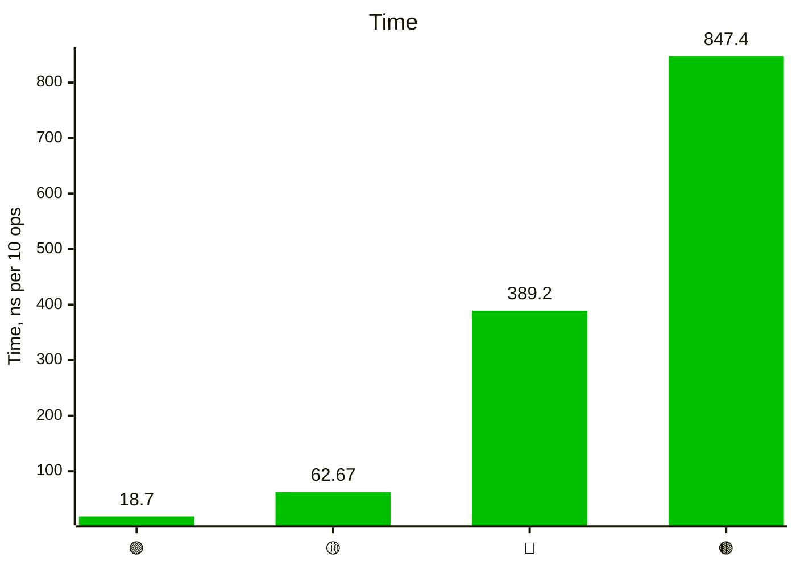
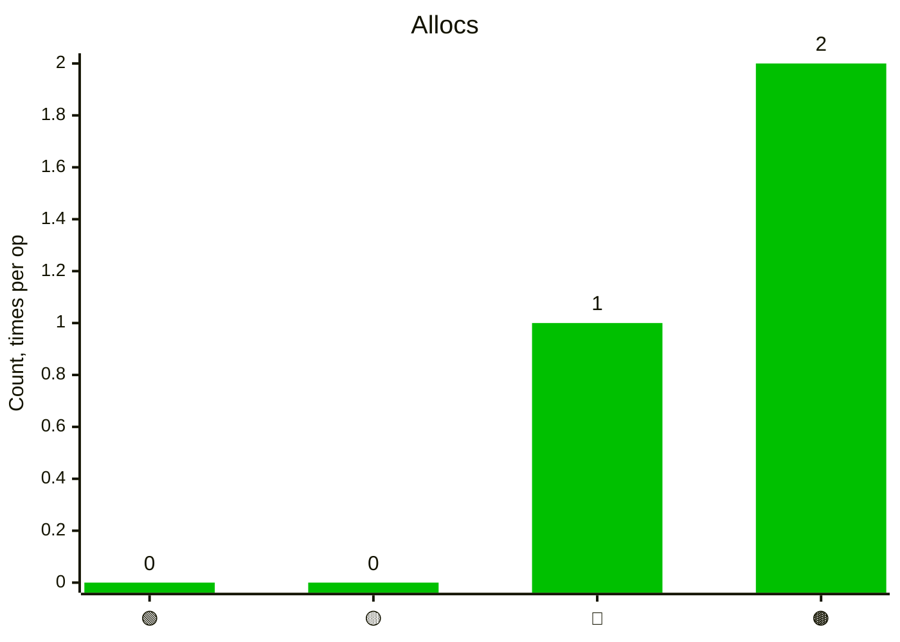
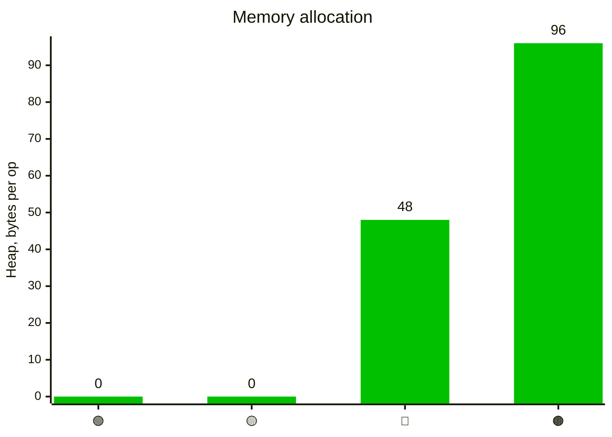

# Ternary benchmarks results collection

## 2026-08-21 NNV

Issue [#1 Go 1.27](https://github.com/mail2nnv/ternary/issues/1)

<details><summary>Results</summary>

```console
Running tool: go.exe test -test.fullpath=true -benchmem -run=^$ -bench ^Benchmark_If$ github.com/mail2nnv/ternary/bench -count=1 -v

goos: windows
goarch: amd64
pkg: github.com/mail2nnv/ternary/bench
cpu: Intel(R) Core(TM) i5-3570 CPU @ 3.40GHz
Benchmark_If
Benchmark_If/Native_if-then-else
Benchmark_If/Native_if-then-else-4
63907542	        18.70 ns/op	       0 B/op	       0 allocs/op
Benchmark_If/Ternary_if-then-else
Benchmark_If/Ternary_if-then-else-4
16940896	        62.67 ns/op	       0 B/op	       0 allocs/op
Benchmark_If/Ternary_if-thenF-else
Benchmark_If/Ternary_if-thenF-else-4
 3068961	       389.2 ns/op	     480 B/op	      10 allocs/op
Benchmark_If/Ternary_if-thenF-elseF
Benchmark_If/Ternary_if-thenF-elseF-4
 1484044	       847.4 ns/op	     960 B/op	      20 allocs/op
PASS
ok  	github.com/mail2nnv/ternary/bench	4.765s
```

</details>

### Graph

- 🟢 — Native if-then-else
- 🟡 — Ternary IF.Then.Else
- 🔴 — Ternary IF.ThenF.Else
- 🟤 — Ternary IF.ThenF.ElseF

#### Time



#### Allocs



#### Memory allocation


