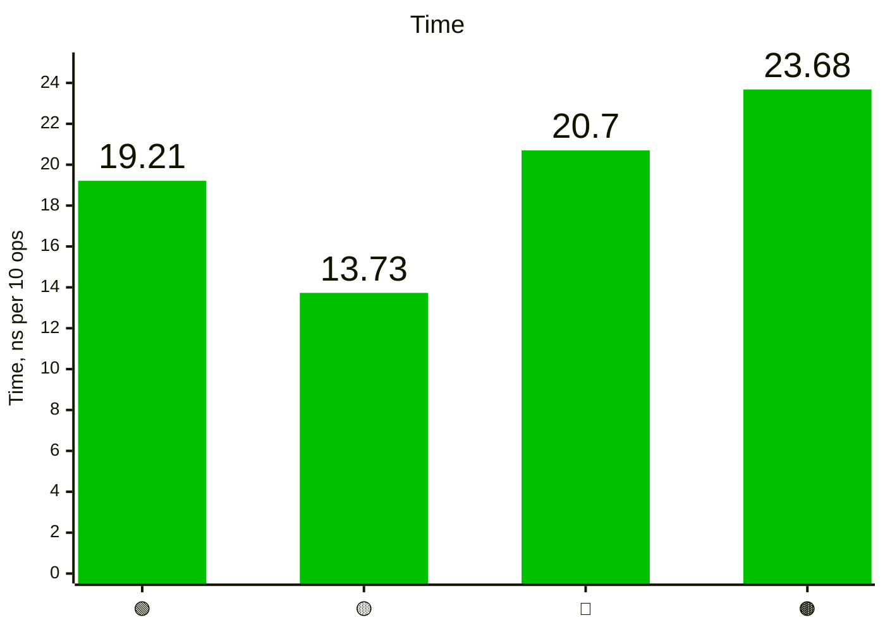

# Ternary benchmarks results collection

## 2026-10-09 NNV

Issue [#2 Avoid type specification for If](https://github.com/mail2nnv/ternary/issues/2)

<details><summary>Results</summary>

```console
Running tool: go.exe test -test.fullpath=true -benchmem -run=^$ -bench ^Benchmark_If$ github.com/mail2nnv/ternary/bench -count=1 -v

goos: windows
goarch: amd64
pkg: github.com/mail2nnv/ternary/bench
cpu: Intel(R) Core(TM) i5-3570 CPU @ 3.40GHz
Benchmark_If
Benchmark_If/Native_if-then-else
Benchmark_If/Native_if-then-else-4
61280844	        19.21 ns/op	       0 B/op	       0 allocs/op
Benchmark_If/Ternary_if-then-else
Benchmark_If/Ternary_if-then-else-4
87537025	        13.73 ns/op	       0 B/op	       0 allocs/op
Benchmark_If/Ternary_if-thenF-else
Benchmark_If/Ternary_if-thenF-else-4
49470255	        20.70 ns/op	       0 B/op	       0 allocs/op
Benchmark_If/Ternary_if-thenF-elseF
Benchmark_If/Ternary_if-thenF-elseF-4
55177735	        23.68 ns/op	       0 B/op	       0 allocs/op
PASS
ok  	github.com/mail2nnv/ternary/bench	4.763s
```

</details>

### Graph

- 🟢 — Native if-then-else
- 🟡 — Ternary IF.Then.Else
- 🔴 — Ternary IF.ThenF.Else
- 🟤 — Ternary IF.ThenF.ElseF

#### Time



#### Allocs

Zero
