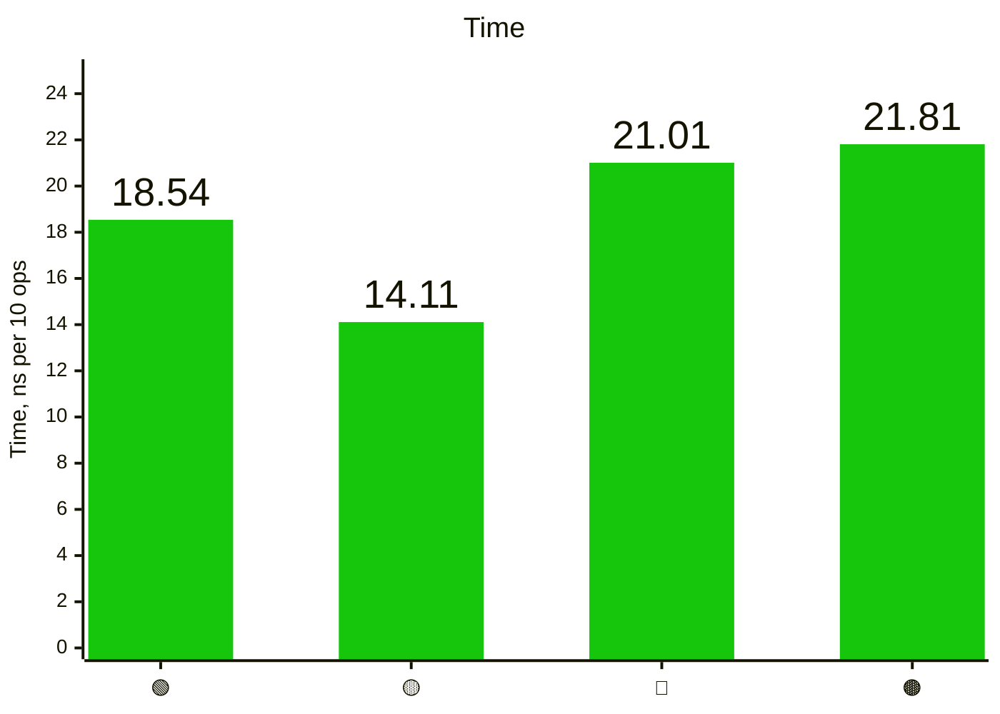
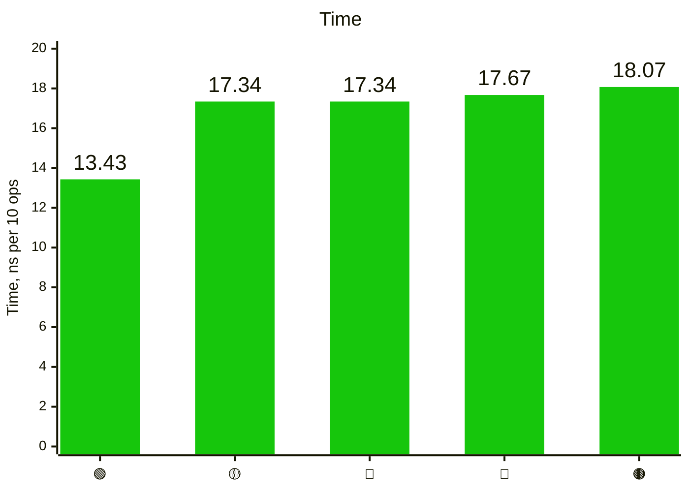

# Lastest Ternary benchmarks results collection

## 2026-10-09 NNV

## If

<details><summary>Benchmark_If results</summary>

```console
Running tool: go.exe test -test.fullpath=true -benchmem -run=^$ -bench ^Benchmark_If$ github.com/mail2nnv/ternary/bench -count=1 -v

goos: windows
goarch: amd64
pkg: github.com/mail2nnv/ternary/bench
cpu: Intel(R) Core(TM) i5-3570 CPU @ 3.40GHz
Benchmark_If
Benchmark_If/Native_if-then-else
Benchmark_If/Native_if-then-else-4
65421927	        18.54 ns/op	       0 B/op	       0 allocs/op
Benchmark_If/Ternary_if-then-else
Benchmark_If/Ternary_if-then-else-4
84605658	        14.11 ns/op	       0 B/op	       0 allocs/op
Benchmark_If/Ternary_if-thenF-else
Benchmark_If/Ternary_if-thenF-else-4
57215788	        21.01 ns/op	       0 B/op	       0 allocs/op
Benchmark_If/Ternary_if-thenF-elseF
Benchmark_If/Ternary_if-thenF-elseF-4
55313196	        21.81 ns/op	       0 B/op	       0 allocs/op
PASS
ok  	github.com/mail2nnv/ternary/bench	5.121s
```

</details>

- 🟢 — Native if-then-else
- 🟡 — Ternary IF.Then.Else
- 🔴 — Ternary IF.ThenF.Else
- 🟤 — Ternary IF.ThenF.ElseF



## Switch

<details><summary>Benchmark_Switch results</summary>

```console
Running tool: go.exe test -test.fullpath=true -benchmem -run=^$ -bench ^Benchmark_Switch$ github.com/mail2nnv/ternary/bench -count=1 -v

goos: windows
goarch: amd64
pkg: github.com/mail2nnv/ternary/bench
cpu: Intel(R) Core(TM) i5-3570 CPU @ 3.40GHz
Benchmark_Switch
Benchmark_Switch/Native_switch
Benchmark_Switch/Native_switch-4
77930174	        13.43 ns/op	       0 B/op	       0 allocs/op
Benchmark_Switch/Ternary_switch
Benchmark_Switch/Ternary_switch-4
58294024	        17.34 ns/op	       0 B/op	       0 allocs/op
Benchmark_Switch/Ternary_switch_case_closure
Benchmark_Switch/Ternary_switch_case_closure-4
69186507	        17.34 ns/op	       0 B/op	       0 allocs/op
Benchmark_Switch/Ternary_switch_return_closure
Benchmark_Switch/Ternary_switch_return_closure-4
68082402	        17.67 ns/op	       0 B/op	       0 allocs/op
Benchmark_Switch/Ternary_switch_case_and_return_closures
Benchmark_Switch/Ternary_switch_case_and_return_closures-4
66942638	        18.07 ns/op	       0 B/op	       0 allocs/op
PASS
ok  	github.com/mail2nnv/ternary/bench	5.735s
```

</details>

- 🟢 — Native switch
- 🟡 — Ternary Switch.Case
- 🔴 — Ternary Switch.CaseK
- 🔵 — Ternary Switch.CaseV
- 🟤 — Ternary Switch.CaseKV


